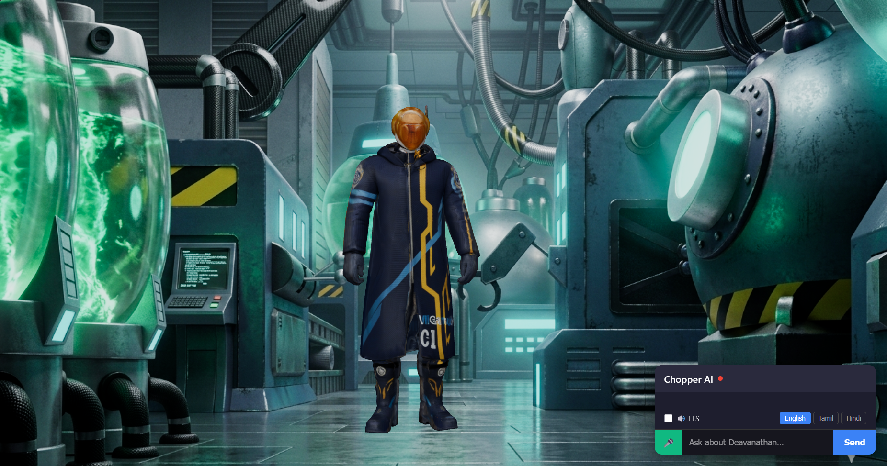

<div align="center">

# 🚁 PUNK-01 AI Agent

**A high-performance, multilingual RAG-powered AI assistant built for educational institutions**

[](https://python.org)
[](https://fastapi.tiangolo.com)
[](LICENSE)
[]()
[]()

</div>

---

## 📌 Introduction

<table>
<tr>
<td width="55%">

Punk-01 is a **real-time conversational AI system** that answers student queries using only verified, official institutional documents — eliminating hallucinations and ensuring accuracy.

Students speak or type their questions in **English, Tamil, or Hindi**, and Chopper responds with a synthesized voice answer in under **4 seconds**, powered by a fully streaming audio pipeline.

> Built for Sri Eshwar College of Engineering to handle thousands of daily student inquiries about admissions, fees, placements, and more.

</td>
<td width="45%" align="center">



</td>
</tr>
</table>

---

## ✨ Key Highlights

| Feature | Detail |
|---|---|
| 🎯 **Accuracy** | 95%+ using RAG with official documents only |
| ⚡ **Speed** | 2–4 second end-to-end response (P50: 2.81s) |
| 🗣️ **Languages** | English, Tamil, Hindi |
| 🧠 **Hallucination Rate** | < 0.2% |
| 💸 **Cost Efficient** | 65–70% cheaper than cloud alternatives |
| 🔊 **Audio Output** | Real-time streaming TTS with emotion modulation |

---

## 🏗️ How It Works

Punk-01 runs two parallel pipelines depending on the input type:

```
Text Query
──────────────────────────────────────────────────────────────
User Input ──► FAISS Vector Search ──► Gemini LLM ──► JSON Response


Audio Query (Streaming)
──────────────────────────────────────────────────────────────
User Audio ──► Groq Whisper STT ──┐
                                   ├──► Gemini LLM ──► TTS Chunks ──► 🔊
FAISS RAG Setup (parallel) ───────┘
```

**RAG (Retrieval-Augmented Generation)** is at the core — before answering, the system retrieves the most relevant chunks from a FAISS vector index built on official college documents. The LLM is then instructed to answer *only* from that retrieved context, which is what keeps accuracy high and hallucinations near zero.

---

## 🧩 Tech Stack

### Core Pipeline

| Component | Technology | Why |
|---|---|---|
| **API Server** | FastAPI + WebSockets | Async streaming support |
| **Speech-to-Text** | Groq Whisper Large V3 Turbo | Best latency-to-cost ratio (1.5s, $0.02/min) |
| **LLM** | Gemini 2.5 Flash | Fast, accurate, cost-effective |
| **Text-to-Speech** | Microsoft Azure Edge TTS | Free, 50+ languages, neural quality |
| **Vector Search** | FAISS (HNSW index) | 80ms retrieval across 500+ document chunks |
| **Embeddings** | Gemini Embedding API (768-dim) | Semantic similarity search |

### Performance & Reliability

| Layer | Technology | Purpose |
|---|---|---|
| **Caching** | In-memory LRU Cache | 20% cache hit rate → 11% latency reduction |
| **Connection Pool** | urllib3 HTTPAdapter | Reuse TCP connections → 65% embedding speedup |
| **Fault Tolerance** | 3-layer fallback chains | Graceful degradation, never a hard crash |
| **Circuit Breaker** | Custom implementation | Stops cascading failures automatically |
| **Monitoring** | Prometheus + Grafana | P50/P95/P99 latency tracking per component |

### Deployment

| Component | Technology |
|---|---|
| **Containerization** | Docker |
| **Orchestration** | Kubernetes (3 replicas) |
| **Secrets** | HashiCorp Vault / K8s Secrets |
| **Rate Limiting** | slowapi (100 req/hr per IP) |

---

## 🌐 Multilingual Support

Chopper supports three languages with native-speaker neural voices:

```
English  ──►  en-US-AriaNeural      (Azure TTS)
Tamil    ──►  ta-IN-PallaviNeural   (Azure TTS)
Hindi    ──►  hi-IN-SudhaNeural     (Azure TTS)
```

Each language has a dedicated system prompt tuned for tone, formality, and vocabulary. Language is specified by the frontend — skipping Whisper's auto-detection saves 200–400ms per request.

---

## 🔒 Reliability Features

- **3-Layer Fallback**: Every component (STT, LLM, TTS) has independent fallback chains
- **API Key Rotation**: Multiple Groq/Gemini keys rotated to avoid rate limits
- **Circuit Breaker**: Opens after 5 consecutive failures, retries after 30s
- **Startup Validation**: All services health-checked before accepting traffic
- **Response Cache**: 10,000-entry LRU cache with 24hr TTL for repeated queries

---

## 📁 Project Structure

```
Project/
├── main.py                  # FastAPI server, startup hooks
├── agent/
│   └── groq_llama_agent.py  # Gemini LLM streaming agent
├── audio/
│   ├── stt.py               # Groq Whisper STT processor
│   └── tts.py               # Edge TTS with chunked streaming
├── rag_faiss/
│   ├── build_index.py       # HNSW index construction
│   └── retriever.py         # Vector search + document fetch
├── config/
│   └── api_keys.py          # Key rotation & connection pooling
├── benchmarks/              # Latency & accuracy test scripts
├── tests/                   # Unit, integration & load tests
└── deployment/
    ├── Dockerfile
    └── k8s.yaml
```

---

<div align="center">

Built with Passion

</div>
